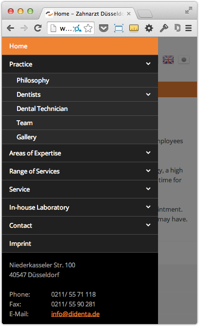

# Mobile Menu extension for Contao Open Source CMS

Mobile Menu is an extension for the [Contao Open Source CMS](https://contao.org).

Add the mobile menu to your website that can be accessed on tablets and phone devices. The extension inserts a mobile menu trigger that can be any HTML code, e.g. image, text or both combined. When the trigger is clicked a left panel is shown. It can contain any content as well - navigation menu, contact details, search box, etc.

The navigation module inside the panel will automatically be granted an extra functionality. By default the subitems are hidden but they can be toggled by clicking the parent record. Another click on the parent record will take the visitor to its page.

The script requires a jQuery to be included on your page.

## Documentation

[Read the documentation](docs/README.md)

## Copyright

This project has been created and is maintained by [Codefog](https://codefog.pl).
